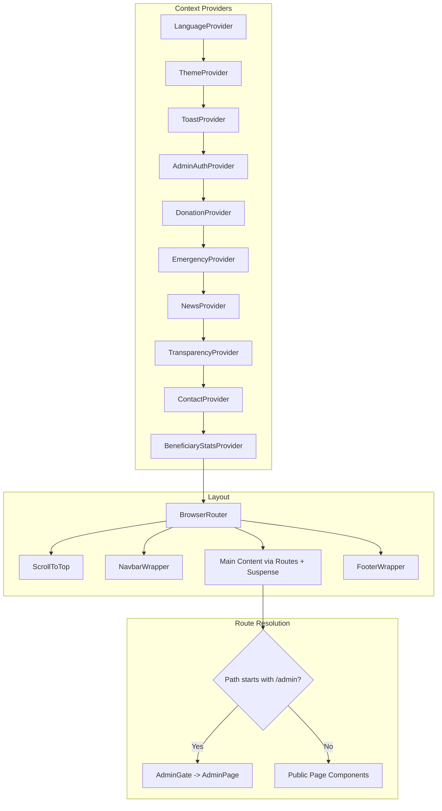

# Hibret Lebego (HL NGO) — Frontend  
  
<div align="center">  
  
**A modern, responsive SPA for Hibret Lebego Ethiopian Charity Association, designed to facilitate humanitarian efforts through digital engagement.**  
  
[](https://reactjs.org/)  
[](https://www.typescriptlang.org/)  
[](https://vitejs.dev/)  
[](https://tailwindcss.com/)  
  
[Report Bug](https://github.com/teston-25/UI-HL_NGO/issues) · [Request Feature](https://github.com/teston-25/UI-HL_NGO/issues)  
  
</div>  
  
---  
  
## Table of Contents  
  
- [Features](#-features)  
- [Tech Stack](#-tech-stack)  
- [Architecture Overview](#-architecture-overview)  
- [Project Structure](#-project-structure)  
- [Getting Started](#-getting-started)  
- [Available Scripts](#-available-scripts)  
- [Routing & Pages](#-routing--pages)  
- [State Management](#-state-management)  
- [API Service Layer](#-api-service-layer)  
- [Technical Deep Dive](#-technical-deep-dive)  
- [Contributing](#-contributing)  
  
---  
  
## Features  
  
- **Responsive UI** — Component-driven design with Tailwind CSS, optimized for all screen sizes.  
- **Bilingual Support** — Full English and Amharic (አማርኛ) translations via a custom `LanguageContext`.  
- **Dark / Light Mode** — Theme toggle persisted to `localStorage`, powered by Tailwind's `class` strategy.  
- **Donation Flow** — Secure donation processing with tiered giving options.  
- **Emergency Crisis Reporting** — Real-time emergency pages with urgent appeal banners and statistics.  
- **News & Stories** — Dynamic news feed with featured stories and field reports.  
- **Financial Transparency** — Detailed breakdowns of fund allocation, annual reports, and audit information.  
- **Admin Dashboard** — Protected management suite with JWT authentication for managing NGO operations.  
- **Interactive Maps** — Location-based features using React Leaflet and Leaflet.  
- **Smooth Animations** — Page transitions and scroll-triggered effects via Framer Motion.  
- **Code Splitting** — Route-based lazy loading with `React.lazy` and `Suspense` for fast initial loads.  
  
---  
  
## Tech Stack  
  
| Category       | Technology       | Version        | Purpose                                         |  
| :------------- | :--------------- | :------------- | :---------------------------------------------- |  
| **UI Library** | React            | ^18.3.1        | Component-based user interface                  |  
| **Language**   | TypeScript       | ^5.5.4         | Static typing for reliability                   |  
| **Build Tool** | Vite             | ^5.2.0         | Fast dev server and optimized production builds  |  
| **Styling**    | Tailwind CSS     | 3.4.17         | Utility-first responsive CSS framework          |  
| **Routing**    | React Router DOM | ^6.26.2        | Declarative client-side routing                 |  
| **HTTP Client**| Axios            | ^1.13.6        | Promise-based API communication                 |  
| **Animations** | Framer Motion    | ^11.5.4        | Declarative motion and transitions              |  
| **Icons**      | Lucide React     | 0.522.0        | Lightweight SVG icon library                    |  
| **Maps**       | React Leaflet / Leaflet | ^4.2.1 / ^1.9.4 | Interactive map components              |  
| **Emotion**    | @emotion/react   | ^11.13.3       | CSS-in-JS for select components                 |  
  
---  
  
## Architecture Overview  
  
The application follows a **provider-pattern architecture** where global and domain-specific state is injected at the root level via nested React Context providers.  
  

  
- **Navbar and Footer** are conditionally hidden on admin routes via `NavbarWrapper` and `FooterWrapper`.  
- All public page components are **lazy-loaded** for performance.  
- Admin routes are **protected** behind `AdminGate`, which checks JWT authentication.  
  
---  
  
## Project Structure  
  
```  
UI-HL_NGO/  
├── public/                        # Static assets (favicons, manifest)  
├── src/  
│   ├── assets/                    # Global media, images, and brand logos  
│   ├── components/                # Shared UI components  
│   │   ├── admin/                 # Admin-specific components  
│   │   │   ├── AdminTable.tsx     # Reusable admin data table  
│   │   │   ├── StatCard.tsx       # Dashboard statistic card  
│   │   │   └── TabError.tsx       # Error boundary for admin tabs  
│   │   ├── AdminGate.tsx          # Authentication guard for admin routes  
│   │   ├── Footer.tsx             # Site footer  
│   │   ├── Navbar.tsx             # Site navigation bar  
│   │   └── Toast.tsx              # Toast notification provider  
│   ├── context/                   # React Context providers  
│   │   ├── AdminAuthContext.tsx   # Admin authentication state  
│   │   ├── BeneficiaryStatsContext.tsx  
│   │   ├── ContactContext.tsx  
│   │   ├── DonationContext.tsx  
│   │   ├── EmergencyContext.tsx  
│   │   ├── LanguageContext.tsx    # i18n (English / Amharic)  
│   │   ├── NewsContext.tsx  
│   │   ├── ThemeContext.tsx       # Dark / Light mode  
│   │   └── TransparencyContext.tsx  
│   ├── hooks/                     # Custom React hooks  
│   │   └── useModalState.ts      # Modal open/close state helper  
│   ├── pages/                     # Page-level route components  
│   │   ├── admin/                 # Admin dashboard  
│   │   │   ├── components/        # Admin page sub-components  
│   │   │   ├── hooks/             # Admin-specific hooks  
│   │   │   ├── tabs/              # Dashboard tab views  
│   │   │   ├── types/             # Admin TypeScript types  
│   │   │   ├── AdminLoginPage.tsx  
│   │   │   └── AdminPage.tsx  
│   │   ├── AboutPage.tsx  
│   │   ├── AdvocacyPage.tsx  
│   │   ├── ContactPage.tsx  
│   │   ├── DonatePage.tsx  
│   │   ├── EmergenciesPage.tsx  
│   │   ├── HomePage.tsx  
│   │   ├── ImpactPage.tsx  
│   │   ├── LegalPage.tsx  
│   │   ├── NewsPage.tsx  
│   │   ├── PartnerPage.tsx  
│   │   ├── PastProjectsPage.tsx  
│   │   ├── ProgramsPage.tsx  
│   │   ├── TransparencyPage.tsx  
│   │   ├── VolunteerPage.tsx  
│   │   └── WhatWeDo.tsx  
│   ├── services/                  # API service layer  
│   │   ├── api/                   # Domain-specific API modules  
│   │   │   ├── adminApi.tsx  
│   │   │   ├── auditLogApi.tsx  
│   │   │   ├── authApi.tsx  
│   │   │   ├── beneficiaryStatsApi.tsx  
│   │   │   ├── contactApi.tsx  
│   │   │   ├── donationApi.tsx  
│   │   │   ├── emergencyApi.tsx  
│   │   │   ├── newsApi.tsx  
│   │   │   └── transparencyApi.tsx  
│   │   └── axios.tsx              # Axios instance with JWT interceptors  
│   ├── App.tsx                    # Root component with providers & routes  
│   ├── global.d.ts                # Global TypeScript declarations  
│   ├── index.css                  # Global styles & Tailwind directives  
    └── index.tsx                  # Application entry point  

```  
  
---  
  
## Getting Started  
  
### Prerequisites  
  
> [!IMPORTANT]  
> Ensure you have **Node.js 18.x** or higher installed.  
  
- **Package Manager:** npm (v9+) or yarn  
- **Backend:** This frontend expects a backend service at `http://127.0.0.1:5000`  
  
### Installation & Setup  
  
**1. Clone & Enter**  
  
```bash  
git clone https://github.com/teston-25/UI-HL_NGO.git  
cd UI-HL_NGO  
```  
  
**2. Install Dependencies**  
  
```bash  
npm install  
```  
  
**3. Configure Environment**  
  
```bash  
cp .env.example .env  
```  
  
Available variables (all optional):  
  
| Variable          | Description                    |  
| :---------------- | :----------------------------- |  
| `VITE_ADMIN_USER` | Override default admin username |  
| `VITE_ADMIN_PASS` | Override default admin password |  
  
> **Important:** Never commit your `.env` file to version control.  
  
**4. Start Development Server**  
  
```bash  
npm run dev  
```  
  
The dev server starts at **http://localhost:3000**. API requests to `/api/*` are proxied to `http://127.0.0.1:5000`.  
  
---  
  
## Available Scripts  
  
| Action      | Command           | Result                                                       |  
| :---------- | :---------------- | :----------------------------------------------------------- |  
| **Develop** | `npm run dev`     | Spins up Vite dev server with Hot Module Replacement (HMR).  |  
| **Build**   | `npm run build`   | Compiles TS and runs Vite build for production.              |  
| **Preview** | `npm run preview` | Locally serve the production build for testing.              |  
| **Lint**    | `npm run lint`    | Run ESLint to catch code smells and formatting issues.       |  
  
---  
  
## Routing & Pages  
  
### Public Pages  
  
| Route                       | Component            | Description                                        |  
| :-------------------------- | :------------------- | :------------------------------------------------- |  
| `/`                         | `HomePage`           | Landing page with hero, stats, programs, testimonials |  
| `/about`                    | `AboutPage`          | Origin story, mission, values, team                |  
| `/programs`                 | `ProgramsPage`       | Core programs: education, water, health            |  
| `/donate`                   | `DonatePage`         | Donation form with tiered amounts                  |  
| `/transparency`             | `TransparencyPage`   | Fund allocation breakdown and accountability       |  
| `/financial-accountability` | `TransparencyPage`   | Alias for transparency page                        |  
| `/contact`                  | `ContactPage`        | Contact form and information                       |  
| `/how-we-work`              | `HowWeWorkPage`      | Methodology: medical coverage, rehab, advocacy     |  
| `/emergencies`              | `EmergenciesPage`    | Active crisis reporting and emergency appeals      |  
| `/news`                     | `NewsPage`           | Latest news, featured stories, field reports       |  
| `/partner`                  | `PartnerPage`        | Corporate sponsorship and partnership info         |  
| `/advocacy`                 | `AdvocacyPage`       | Policy campaigns and civic engagement              |  
| `/volunteer-internship`     | `VolunteerPage`      | Volunteer and internship opportunities             |  
| `/legal-governance`         | `LegalPage`          | Legal structure and governance info                |  
| `/impact`                   | `ImpactPage`         | Impact metrics and results                         |  
| `/past-projects`            | `PastProjectsPage`   | Archive of completed projects                      |  
  
### Admin Dashboard  
  
| Route          | Component   | Description                                                    |  
| :------------- | :---------- | :------------------------------------------------------------- |  
| `/admin`       | `AdminGate` | Login gate — redirects to `/admin/dashboard`                   |  
| `/admin/:tab`  | `AdminPage` | Tab-based dashboard (news, donations, beneficiaries, contacts, audit logs, settings) |  
  
Admin routes are protected by `AdminGate`, which verifies JWT tokens stored in `localStorage`.  
  
---  
  
## State Management  
  
State is managed via **React Context** with domain-specific providers. Each provider wraps the app at the root level in `App.tsx`.  
  
| Context                   | Purpose                                              |  
| :------------------------ | :--------------------------------------------------- |  
| `LanguageContext`         | Current language (`en` / `am`) and translation strings |  
| `ThemeContext`            | Dark/light mode toggle, persisted to `localStorage`  |  
| `AdminAuthContext`        | Admin authentication state and JWT token management  |  
| `DonationContext`         | Donation records and processing state                |  
| `EmergencyContext`        | Emergency/crisis data                                |  
| `NewsContext`             | News articles and stories                            |  
| `TransparencyContext`     | Financial transparency and reporting data            |  
| `ContactContext`          | Contact form submissions                             |  
| `BeneficiaryStatsContext` | Beneficiary statistics and metrics                   |  
  
---  
  
## API Service Layer  
  
All HTTP communication goes through a centralized **Axios instance** (`src/services/axios.tsx`) configured with:  
  
- **Base URL:** `/api` (proxied to the backend in development)  
- **Timeout:** 10 seconds  
- **Request interceptor:** Automatically attaches JWT token from `localStorage` as a `Bearer` token  
- **Response interceptor:**  
  - **401 Unauthorized** — Clears stored auth data and redirects to `/admin`  
  - **429 Rate Limited** — Logs rate-limit warnings  
  - **Network errors** — Logs backend unreachable errors  
  
### Domain API Modules  
  
Located in `src/services/api/`:  
  
| Module                    | Handles                                |  
| :------------------------ | :------------------------------------- |  
| `authApi.tsx`             | Admin login/logout and token management |  
| `adminApi.tsx`            | Admin user CRUD operations             |  
| `newsApi.tsx`             | News article CRUD                      |  
| `donationApi.tsx`         | Donation records and processing        |  
| `emergencyApi.tsx`        | Emergency/crisis data management       |  
| `transparencyApi.tsx`     | Financial transparency reports         |  
| `contactApi.tsx`          | Contact form submissions               |  
| `beneficiaryStatsApi.tsx` | Beneficiary statistics                 |  
| `auditLogApi.tsx`         | Admin audit log retrieval              |  
  
---  
  
## Technical Deep Dive  
  
<details>  
<summary><b>Bilingual Support (i18n)</b></summary>  
  
The app uses a `LanguageContext` that wraps all components. Translations are stored in structured typed objects, allowing instant switching between **English** and **Amharic** without page reloads.  
  
```tsx  
const { t, language, setLanguage } = useLanguage();  
// t.nav_donate → "Donate Now" (en) or "አሁን ይለግሱ" (am)  
```  
  
</details>  
  
<details>  
<summary><b>Protected Routes</b></summary>  
  
The `AdminGate` component checks the `AdminAuthContext` for a valid JWT. Unauthorized users are automatically redirected to the `/admin` login page.  
  
</details>  
  
<details>  
<summary><b>Theming System</b></summary>  
  
Powered by Tailwind CSS `dark:` variants. The theme state is managed via `ThemeProvider` and persisted to `localStorage`.  
  
**Brand Colors** (defined in `tailwind.config.js`):  
  
| Token              | Value     |  
| :----------------- | :-------- |  
| `brand-green`      | `#86efac` |  
| `brand-green-dark` | `#22c55e` |  
| `brand-red`        | `#B91C1C` |  
| `brand-red-dark`   | `#991B1B` |  
| `brand-white`      | `#FFFFFF` |  
  
</details>  
  
<details>  
<summary><b>Performance Optimizations</b></summary>  
  
- **Lazy Loading:** All public page components use `React.lazy()` with `Suspense` fallback  
- **Manual Chunk Splitting:** Vendor libraries split into `vendor-react`, `vendor-motion`, `vendor-lucide`, `vendor-axios`  
- **Terser Minification:** Production builds strip `console.*` and `debugger` statements  
- **Chunk Size Warning:** Set at 500 KB to catch oversized bundles  
- **Dependency Pre-bundling:** Core dependencies pre-bundled for faster dev server startup  
  
</details>  
  
---  
  
## Contributing  
  
We welcome contributions! Follow these steps:  
  
1. **Fork** the repository  
2. **Branch:** `git checkout -b feature/your-feature`  
3. **Commit:** `git commit -m 'Add your feature'`  
4. **Push:** `git push origin feature/your-feature`  
5. **Pull Request:** Open a PR from your branch  
  
---  
  
## License  
  
This project is private. See the repository settings for access and usage terms.
