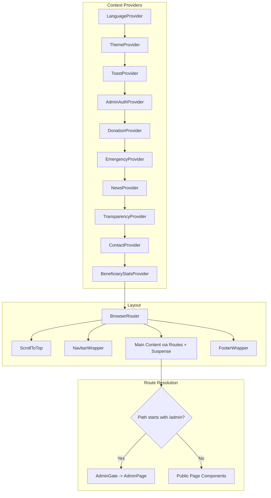

# 🏥 Hibret Lebego (HL NGO) — Frontend

<div align="center">

**A modern, responsive SPA for Hibret Lebego Ethiopian Charity Association, designed to facilitate humanitarian efforts through digital engagement.**

[](https://reactjs.org/)
[](https://www.typescriptlang.org/)
[](https://vitejs.dev/)
[](https://tailwindcss.com/)
[](https://opensource.org/licenses/MIT)

[🚀 Live Demo](https://prms-frontend.netlify.app) • [📖 Documentation](https://github.com/teston-25/UI-HL_NGO/wiki) • [🐛 Report Bug](https://github.com/teston-25/UI-HL_NGO/issues)

</div>

---

## 📋 Table of Contents

- [Features](#features)
- [Tech Stack](#tech-stack)
- [Architecture Overview](#architecture-overview)
- [Project Structure](#project-structure)
- [Getting Started](#getting-started)
- [Routing & Pages](#routing--pages)
- [State Management](#state-management)
- [API Service Layer](#api-service-layer)
- [Performance & Theming](#theming)

---

## ✨ Features

- **Responsive UI** — Component-driven design with Tailwind CSS, optimized for all screen sizes.
- **Bilingual Support** — Full English and Amharic (አማርኛ) translations via a custom `LanguageContext`.
- **Dark / Light Mode** — Theme toggle persisted to `localStorage`, powered by Tailwind's `class` strategy.
- **Donation Flow** — Secure donation processing with tiered giving options.
- **Emergency Crisis Reporting** — Real-time emergency pages with urgent appeal banners and statistics.
- **Financial Transparency** — Detailed breakdowns of fund allocation, annual reports, and audit information.
- **Admin Dashboard** — Protected management suite with JWT authentication for managing NGO operations.

---

## 🛠 Tech Stack

| Category       | Technology       | Version | Purpose                                         |
| :------------- | :--------------- | :------ | :---------------------------------------------- |
| **UI Library** | React            | ^18.3.1 | Component-based user interface                  |
| **Language**   | TypeScript       | ^5.5.4  | Static typing for reliability                   |
| **Build Tool** | Vite             | ^5.2.0  | Fast dev server and optimized production builds |
| **Styling**    | Tailwind CSS     | 3.4.17  | Utility-first responsive CSS framework          |
| **Routing**    | React Router DOM | ^6.26.2 | Declarative client-side routing                 |
| **Animations** | Framer Motion    | ^11.5.4 | Declarative motion and transitions              |
| **Maps**       | React Leaflet    | ^4.2.1  | Interactive map components                      |

---

## 🏗 Architecture Overview

The application follows a **provider-pattern architecture** where global and domain-specific state is injected at the root level via nested React Context providers.



## 📂 Project Structure

UI-HL_NGO/
├── public/ # Static assets
├── src/
│ ├── assets/ # Images and logos
│ ├── components/ # Shared UI & Admin components
│ │ ├── AdminGate.tsx # Auth guard
│ │ └── Navbar.tsx # Navigation
│ ├── context/ # React Context (i18n, Theme, Auth)
│ ├── hooks/ # Custom React hooks
│ ├── pages/ # Public pages & Admin dashboard
│ ├── services/ # API layer (Axios & Domain modules)
│ ├── App.tsx # Root component
│ └── index.tsx # Entry point
└── tailwind.config.js # Configuration

````
## 🚀 Getting Started

### Prerequisites

* **Node.js**: 18 or higher
* **npm**: (comes with Node.js)
* **Backend**: A running API server (default: `http://127.0.0.1:5000`) — the Vite dev server proxies `/api` requests to it.

### Installation

```bash
# Clone the repository
git clone [https://github.com/teston-25/UI-HL_NGO.git](https://github.com/teston-25/UI-HL_NGO.git)

# Navigate to directory
cd UI-HL_NGO

# Install dependencies
npm install

````

## Environment Variables

Copy the example file and configure as needed:

```bash

```

cp .env.example .env

```
## 📅 Available Scripts

| Command          | Description                   |
| :--------------- | :---------------------------- |
| npm run dev      | React                         |
| npm run build    | TypeScript                    |
| npm run preview  | Vite                          |
| npm run lint     | Tailwind CSS                  |

```

### 🤝 Contributing

**1**. Fork the repository.
**2**. Create a feature branch: git checkout -b feature/your-feature.
**3**. Commit your changes: git commit -m "Add your feature".
**4**. Push to the branch: git push origin feature/your-feature.
**5**. Open a Pull Request.
